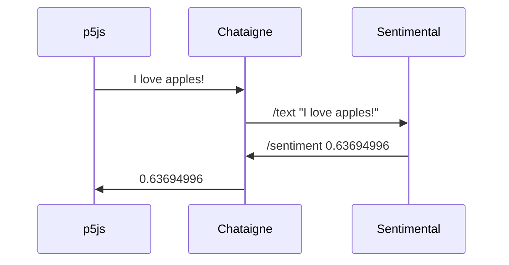

# p5js Chataigne Demos

See the accompanying youtube video here: https://www.youtube.com/watch?v=UjUjzPPUXk0

## Example Folders

Each folder in this repo contains a different demo and a corresponding Chataigne noisette file:

### osc_sentimental (new and not in the youtube video)

A p5js sketch (with a UI made using the DOM functions) sends a text string to the Chataigne websocket server at `127.0.0.1:8080`. Chataigne forwards the string as an OSC `/text` message to a running OSC server (https://github.com/rahji/sentimental) at `127.0.0.1:8884`. The Sentimental OSC server does a sentiment analysis on the text and returns an OSC `/sentiment` message with a floating point number as its value. It sends this OSC message to the Chataigne OSC client running on `127.0.0.1:8885`. Chataigne then sends that floating point number through the websocket to p5js on the other end. Finally, p5.js shows the sentiment value in the browser's console. This example shows a round trip conversation that looks like:

### p5js_dom_pilot

A p5js sketch (with a UI made using the DOM functions) sends strings to a websocket at `127.0.0.1:8080`. The strings are formatted to match the UDP messages that [Pilot](https://github.com/hundredrabbits/Pilot) expects. Chataigne maps the websocket message to a UDP message (going to port `49161`).

### midi_cc_p5js

Chataigne accepts MIDI CC's from a Beatstep and sends them to p5js sketch via Websockets.

### osc_p5draw

TouchOSC phone app (mix2 layout, tab 3) sends OSC messages. Chataigne maps the OSC messages to Websockets. p5js draws using the coordinates from OSC.

### p5play_pilot 

A p5play game triggers Pilot sounds by sending websocket messages converted to UDP by Chataigne

## p5js Websockets Tips

* Websocket messages have a NL tacked onto the end
* Sending the Websocket message with a "name:" prepended onto it, allows Chataigne to address the value using that name, assuming "Message Structure" is "Colon (:) Separated" and "First Values is the Name" is checked

## Chataigne Tips

* Pilot doesn't like its UDP messages to have CR/NL
* Right click on the Mapping's input value and select "Always Notify Changes", or Websockets messages won't actually be mapped when the same string is sent multiple times in a row
* The notion of a server and a client is used with OSC. This requires two different ports - one for the client and one for the server. With WebSockets, both ends (eg: Chataigne and p5.js) stay  connected through the pipe. There is just one websocket port.
